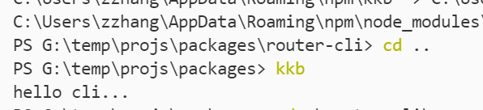
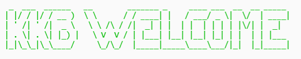
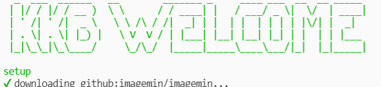

# 2021-09-20

字节青训营实训营day0笔记

## 课前
- 周三周五课程调换
- 要求建立一个github项目，平时会检查commit记录和最后的作业
- 最终推荐面试名额为50，有酌情增减

## NodeJS
slidev: 一个本地托管md文件在浏览器端渲染幻灯片的工具，类似于vscode的插件marp，支持热更新

NODEJS API 
nodejs.cn/api
https://nodejs.org/dist/latest-v10.x/docs/api/
青训营代码
https://github.com/su37josephxia/bytedance-youth-training-camp

核心API 
buffer
module
process

内置：
os: operation system
fs: file system

## fs 文件系统
fs.readFile(target: string, callback: function(err,data))
fs.readFileSync(target: string, callback: function(err,data))

## Buffer
实现了对于C中处理Buffer相关方法的封装，具体见paractise/05_http.js

## HTTP 
practise/04_http.js

小练习：做一个构建一个HTTP服务，把之前的API用上 
Hint：有点想要做一个工具，把自己的笔记和代码整合起来形成一个类似notebook或者codesandbox的简陋沙盒环境，进阶的可能是分块完成注释和代码，并且支持把某一部分代码直接打包成一个模块隐藏起来，自动建立相关联系
练习地址: pacakges/myNotebook

## STREAM
使用fs.createReadStream和fs.createWriteStream建立输入流和输出流，并且使用readStream.pipe(writeStream)将其用管道链接，防止过多数据占用内存。

具体见practise/05_stream.js

## 实现一个手写cli工具并进行部署

任何文件夹下都能启动该命令行，启动

### 初始化文件架构

项目目录如packages/router-cli所示

```
npm init -y
mkdir bin && touch bin/kkb.js
```

```js
#!usr/bin/env node
console.log('Hello Cli ...')
```

npm link模拟全局安装

```
npm link
cd ..
kkb // hello cli ...
```



### 实现命令行欢迎界面



### 实现自动下载模板

ora版本更新出现问题

原因是ora 6.0.0从CommonJS风格转变成了ES风格，弄了一会，发现最简单的解决方案还是直接回退安装上个版本即可，当然引入babel应该也可以，就是会复杂多了

总而言之弄出结果了



### 如何安装依赖

- 本质上就是执行npm i
- 如何在代码运行中执行npm命令呢？子进程child_process

spawn在windows上有些兼容问题，主要是因为命令行的原因

## 课后作业设计1

用双向链接编译构建文件图

### 说明

在markdown中一个比较新颖的语法是双向链接[[]]，意思是当某个文档中需要引用其他文档的时候，可以通过这个符号来定义一个指向其他文档的链接。而通过双向链接实现的文档库经过解析，可以形成一张图来可视化文件之间的复杂引用关系。

我们试图构建一个命令行工具，在某个markdown文件库中使用，可以自动下载模板，用fs获得文件和文件关系资料，生成关系图数据，然后把模板和数据一起编译，并自动发布到浏览器上运行。

## 持久化技术

就是将内存中的数据模型转化为存储中的模型
mysql

通过模型自动映射的RESTful服务

连接池：https://juejin.cn/post/6844904069962661896
用SQL翻页，模糊查询，排序

### ORM: Object Relation Mapping
把对象和数据库联系到一起，操纵对象的时候直接在后台操纵数据库。

sequelize

### ODM:

Mongoose

User的增删查改的API是否可以基于约定的方式自动产生，形成后端的管理界面。

也就是，
input:  
name + {schema}，写成json形式
name: {
  property1: ['string', 'required'],
  property2: ['string'],
}
返回的是方法。

想要数据持久化的话，可以创建一个表存储上面这样的数据，服务端收到接口之后首先查询该表，是否有定义相关的表接口数据，然后根据对应的接口进行查询和返回。

python django框架
java jeecg
js sailsjs, keystonejs

- 代码生成器
- 动态编程

## 加密鉴权
- cookie & session

- jwt token
base64 encoding 
json数据+json载荷（签发时间+过去时间）
OAth本质就是
md5 sha512

## CDN
内容分发网络
同一种内容多处存储
CDN回源和运作
本地缓存数据，通过key-value进行映射
本质上相当于是网络的缓存

## RPC 远程调用
Remote Procedure Call
基于HTTP协议的RPC，或者基于底层二进制协议的RPC


