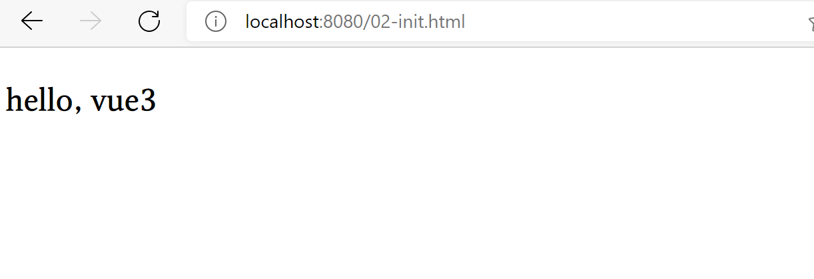

# Day 5

mini-vue, JSX, SFC, MVVM

感觉好像之前在第二天老师的库中看到过一个mini-vue的库，赶紧弄下来研究研究。

## Vue 3

对TS的支持：
- 函数式的支持（签名非常具体）
- 基于class，装饰器

实例化， 有利于tree shaking
复用性：组件庞大且零散，经常横跳，易于封装

API简化，指令
- inserted

指令的写法之前和组件一致性不好，在vue3中进行了一致性的优化。

简化问题：v-model和.sync修饰符几乎没有区别，所以vue3中年就剩下v-model了

扩展性：
createRenderer()实现平台特有的节点操作
querySelector
createElement
（驱动Canvas，原生，小程序）

## mini-vue 
- 入口很难找
- 奇怪的issue解决

明白核心原理，写一个mini版本的实现。

- find root element
- reander the page
  - compile template
  - render the template (using default renderer or costumed renderer)
  - append to root element
 
最开始的时候，我们不考虑复杂的泛化需求，只负责把{{title}}渲染为h3,所以我们只用最简单，最不优雅的方式最快捷地完成需求：
practises/day5/vue-taste/02-init.html

兼容性的问题：使用proxy代理

setup就是created hooks

扩展性问题：
custom renderer

the code is strongly coupling with web browser

use higher function factory

vue2 需要递归
数组需要单独的实现
解决动态新增，删除的问题

Proxy 
Reflect

副作用函数可能嵌套，所以用一个EffectStack去模拟递归

# 虚拟DOM

尽可能减少DOM操作

可能改变不同的key

render函数缠身虚拟DOM

## diff 

通过比较已存在的vnode，最大限度地复用真实存在的节点，从而最小化DOM的操作

性能？

在web平台默认不会进行层级的移动，同层比较，深度优先。

